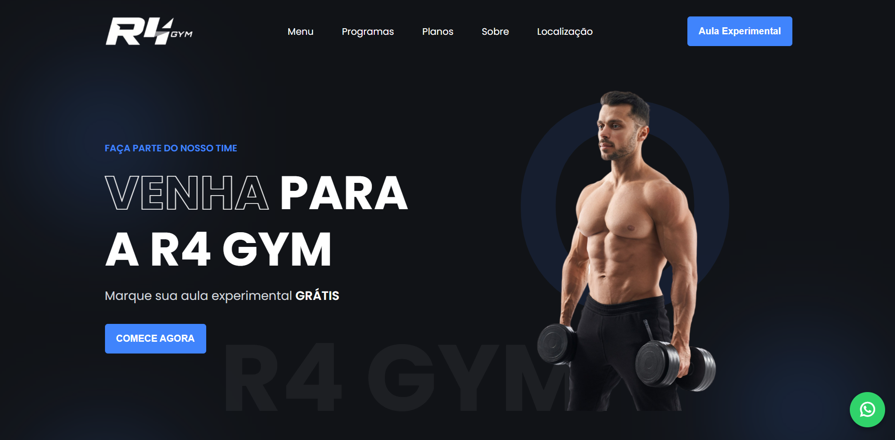
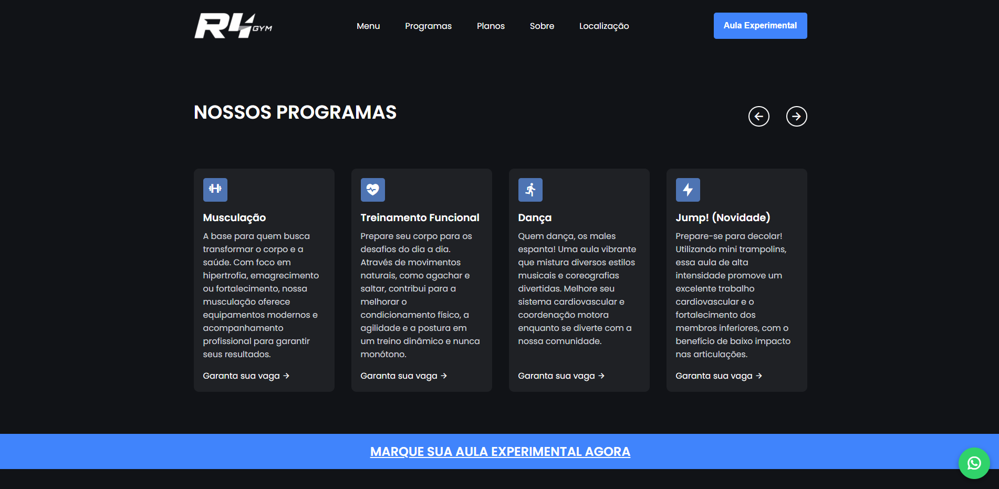
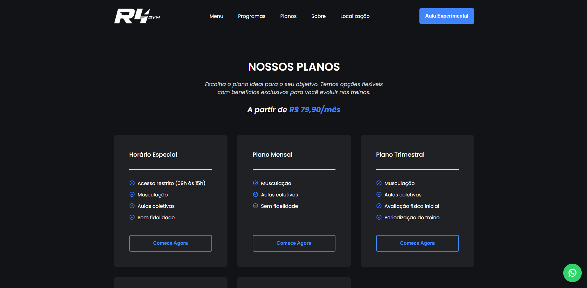

# 🏋️‍♂️ R4 Gym

Interface web da Academia R4 Gym, responsável por apresentar informações institucionais, serviços e planos da academia.

O site foi desenvolvido com foco em experiência do usuário e design moderno, permitindo que visitantes conheçam melhor a academia e entrem em contato de forma rápida.

## 🌐 Aplicação Online
👉 Acesse o site:
<br>
-

## 📌 About

R4 Gym é um website institucional desenvolvido para a academia localizada em Curitiba - Paraná, com o objetivo de fortalecer sua presença digital e atrair novos alunos.

A aplicação apresenta informações completas sobre a academia, incluindo programas de treino, planos, estrutura, galeria de fotos e vídeos, além de disponibilizar um canal direto de contato via WhatsApp.

O projeto foi construído priorizando performance, responsividade e navegação intuitiva, garantindo uma boa experiência tanto em dispositivos desktop quanto mobile.


## 📷 Interface

**Tela inicial do site com apresentação da academia, destaques e acesso rápido às principais seções.**

<p align="center">  </p>
<p align="center">  </p>
<p align="center">  </p>


## 🛠️ Tech Stack

- React
- Vite
- TypeScript
- ESLint + Prettier

## 🏗️ Estrutura do projeto

A estrutura foi organizada de forma simples e escalável, facilitando manutenção e evolução do projeto.
```
├─ public
├─ src
│  ├─ assets
│  ├─ components
│  └─ pages
└─ styles
```

### Descrição das principais pastas
- public → arquivos públicos utilizados para indexação e SEO do site
- assets → imagens, vídeos e arquivos estáticos
- components → componentes reutilizáveis da interface
- pages → páginas do site
- styles → arquivos de estilização

## ▶️ Run

### 1️⃣ Clone o repositório
```
git clone https://github.com/seu-usuario/r4-gym.git
cd r4-gym
```

### 2️⃣ Instalar dependências
```
npm install
```

### 3️⃣ Iniciar aplicação
```
npm run dev
```

